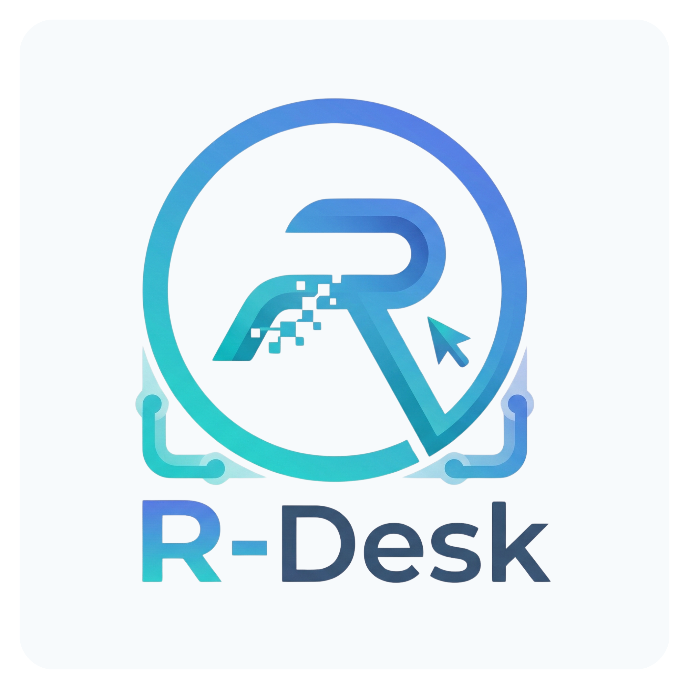

#  R-Desk Remote Desktop Client

<div align="center">

[](https://rdesk.robotoai.com)
[](https://rdesk.robotoai.com)
[](https://rdesk.robotoai.com)
[](LICENSE)
[](https://rdesk.robotoai.com)

**High-Performance, Secure, and Cross-Platform Remote Desktop & Robotics Fleet Management**

[🌐 Official Website](https://rdesk.robotoai.com) • [📦 Releases & Downloads](#-download--releases) • [📖 Installation Guide](INSTALL.md) • [🔧 Troubleshooting](TROUBLESHOOTING.md)

</div>

---

## 🌟 Overview

**R-Desk** is a state-of-the-art remote desktop application developed by **RobotoAI Technologies Pvt. Ltd.** Designed from the ground up using Flutter and WebRTC, R-Desk delivers ultra-low latency desktop sharing, bidirectional audio streaming, and powerful remote control capabilities.

Beyond standard remote desktop features, R-Desk is uniquely optimized for **Robotics and IoT Fleet Management**, allowing seamless remote administration of embedded devices, ARM single-board computers (like Raspberry Pi and NVIDIA Jetson), and desktop workstations alike.

---

## 📦 Download & Releases (Version 1.0.0)

Choose the appropriate installer or package for your operating system and CPU architecture. All binaries are fully standalone and production-ready.

### 🪟 Windows Downloads

| Architecture | File Name | Description | Download Link |
|:---|:---|:---|:---|
| **Windows (x64)** | `r_desk_1.0.0_x64_setup.exe` | Standard 64-bit installer for Windows 10 & 11 PCs. | [Download x64](./windows/stable/version/1.0.0/r_desk_1.0.0_x64_setup.exe) |
| **Windows (ARM64)**| `r_desk_1.0.0_arm64_setup.exe` | Optimized native installer for Windows on ARM (Snapdragon X Elite, Surface Pro 9/11). | [Download ARM64](./windows/stable/version/1.0.0/r_desk_1.0.0_arm64_setup.exe) |

### 🐧 Linux Downloads

| Architecture | File Name | Description | Download Link |
|:---|:---|:---|:---|
| **Linux (All)** | `install.sh` | One-click unified installer for all Linux architectures. | [View Installer](./linux/stable/version/1.0.0/install.sh) |
| **Linux (AMD64)** | `r_desk_1.0.0_compatible_amd64.deb` | Broadly compatible Debian/Ubuntu package for standard x86_64 Linux PCs. | [Download AMD64](./linux/stable/version/1.0.0/r_desk_1.0.0_compatible_amd64.deb) |
| **Linux (ARM64)** | `r_desk_1.0.0_arm64.deb` | Native Debian package for ARM64 SBCs (Raspberry Pi 4/5, NVIDIA Jetson, etc.). | [Download ARM64](./linux/stable/version/1.0.0/r_desk_1.0.0_arm64.deb) |

> [!NOTE]
> Looking for older versions or change history? Check our [Releases page](../../releases) on GitHub.

---

## 🚀 Key Features

* **⚡ Ultra-Low Latency WebRTC Streaming:** Peer-to-peer high-definition video streaming optimized for minimal bandwidth and sub-second latency.
* **🔒 End-to-End Encryption (E2EE):** All sessions are secured with industry-standard DTLS/SRTP encryption protocols. Your data and desktop streams are completely private.
* **🎙️ Bidirectional Audio & Volume Control:** Stream system audio and microphone input simultaneously with granular, real-time volume slider controls.
* **🤖 Robotics & Fleet Integration:** Built-in telemetry tracking, online/offline status indicators, and low-overhead daemon support for remote robotic devices.
* **🎮 Advanced Input Injection:** Full support for remote keyboard, mouse, and joystick/gamepad pass-through to control complex applications and robots remotely.
* **📁 Cross-Platform File Transfer:** Fast, secure, and intuitive file sharing between local and remote machines.

---

## 📖 Quick Start Guide

### Windows Installation
1. Download the appropriate setup file (`r_desk_1.0.0_x64_setup.exe` or `r_desk_1.0.0_arm64_setup.exe`).
2. Double-click the installer and follow the on-screen prompts.
3. Launch **R-Desk** from your Start Menu or Desktop shortcut.

### Linux Installation
We provide a unified, one-click installation script that automatically detects your architecture, installs the correct package, and configures remote control permissions (`uinput`).

You can download and run the installer directly in one command:
```bash
curl -L https://raw.githubusercontent.com/TeamRobotoAI/rdesk_public/main/linux/stable/version/1.0.0/install.sh -o install.sh && curl -L https://raw.githubusercontent.com/TeamRobotoAI/rdesk_public/main/linux/stable/version/1.0.0/setup.sh -o setup.sh && chmod +x install.sh setup.sh && ./install.sh
```
*(Note: You will need to log out and log back in for remote keyboard/mouse permissions to take full effect).*

> [!IMPORTANT]  
> For complete, step-by-step installation instructions and advanced configuration, please read the [Comprehensive Installation Guide (INSTALL.md)](INSTALL.md).

---

## 📂 Repository Structure

```text
rdesk_public/
├── README.md               # This document
├── INSTALL.md              # Detailed installation & permission guide
├── TROUBLESHOOTING.md      # FAQ, common errors, and solutions
├── SECURITY.md             # Security practices and E2EE architecture
├── LICENSE                 # End-User License Agreement
├── linux/stable/version/1.0.0/ # Linux distribution packages
│   ├── install.sh              # One-click unified installer for Linux
│   ├── r_desk_1.0.0_compatible_amd64.deb
│   ├── r_desk_1.0.0_arm64.deb
│   └── setup.sh                # Linux uinput permission helper script
└── windows/stable/version/1.0.0/ # Windows distribution installers
    ├── r_desk_1.0.0_x64_setup.exe
    └── r_desk_1.0.0_arm64_setup.exe
```

---

## 🛠️ Documentation & Support

* **[Installation Guide](INSTALL.md):** In-depth setup instructions for Windows and Linux.
* **[Troubleshooting & FAQ](TROUBLESHOOTING.md):** Solutions for Wayland screen capture, uinput permissions, Windows SmartScreen, and audio setup.
* **[Security Policy](SECURITY.md):** Information regarding our encryption standards and vulnerability reporting.

### Need Help?
If you encounter any issues or have questions regarding enterprise licensing, fleet management deployments, or custom integrations, please reach out to our support team:

* **Web:** [https://rdesk.robotoai.com](https://rdesk.robotoai.com)
* **Company:** RobotoAI Technologies Pvt. Ltd.

---

<div align="center">
  <p>© 2026 RobotoAI Technologies Pvt. Ltd. All Rights Reserved.</p>
</div>
