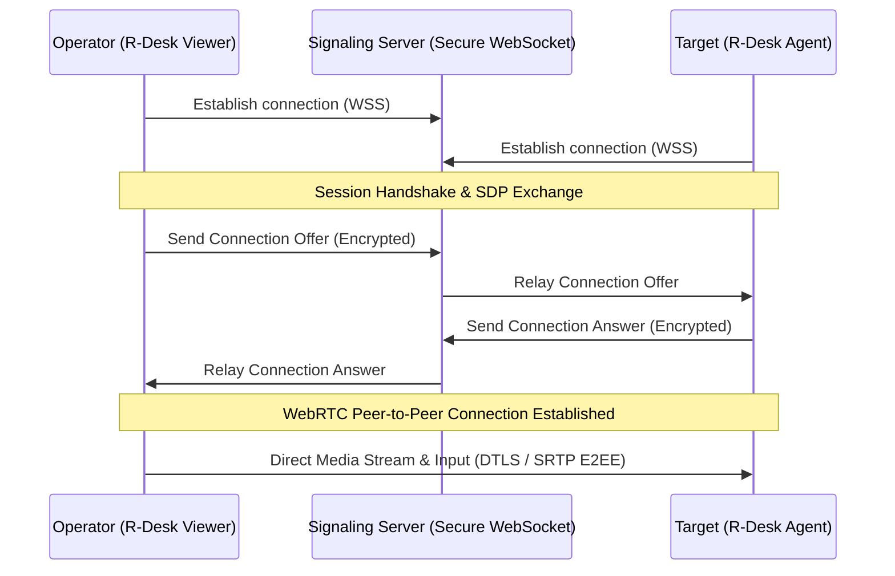

# 🛡️ R-Desk Security Policy & Encryption Architecture

RobotoAI Technologies Pvt. Ltd. is committed to providing a highly secure, reliable, and enterprise-ready remote desktop client. This document outlines the security architecture of R-Desk and details how to report vulnerabilities.

---

## 🔒 Security Architecture

R-Desk utilizes state-of-the-art protocols to ensure that all remote desktop streams, keyboard/mouse inputs, file transfers, and audio feeds remain private and secure.

### 1. Peer-to-Peer WebRTC Architecture
Once a session is established, all video, audio, and control data flows **directly** between the local operator and the remote device via **WebRTC**. In the majority of network setups, no middleman server relays this traffic.

### 2. True End-to-End Encryption (E2EE)
* **DTLS (Datagram Transport Layer Security):** Secure session negotiation and key exchange are handled using DTLS 1.2/1.3.
* **SRTP (Secure Real-time Transport Protocol):** All video and audio feeds are encrypted with AES-GCM (128 or 256-bit) before transmission.
* **Data Privacy:** Neither RobotoAI nor any external signaling node can view or decrypt your screen stream or remote keyboard logs. Key materials are generated locally on the peer endpoints and are never sent to the signaling servers.

### 3. Connection Verification & Safety
* **Access Permissions:** Incoming connections must present a unique session passcode or receive manual confirmation from the remote host user.
* **Granular Controls:** Users can configure incoming session permissions to disable features like file transfer, audio streaming, or clipboard sharing on a per-connection basis.

---

## 📁 Supported Versions

Security updates and patches are actively provided for the following versions:

| Version | Supported | Release Date |
| :--- | :--- | :--- |
| **1.x** |  Active | May 2026 |

---

## 🐛 Reporting a Vulnerability

If you discover a security vulnerability in R-Desk, please do not open a public issue. We ask that you report it to us privately to allow us to release a patch and protect our user base.

### Reporting Channels
Please send detailed vulnerability reports to our dedicated security team:

* **Email:** [security@robotoai.com](mailto:security@robotoai.com)
* **Security Advisories:** [https://rdesk.robotoai.com/security](https://rdesk.robotoai.com/security)

### What to Include
To help us triage and resolve the issue quickly, please provide:
1. A clear description of the vulnerability and its potential impact.
2. step-by-step reproduction instructions (including code snippets, screenshots, or screen recordings if applicable).
3. The platform (Windows/Linux) and version details of the affected client.

### Our Commitment
* We will acknowledge receipt of your report within **24 hours**.
* We will keep you updated on our progress as we investigate and develop a patch.
* Once resolved, we will credit you for the discovery in our security release notes (if desired).

---

  
© 2026 RobotoAI Technologies Pvt. Ltd. All Rights Reserved.

